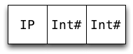

% Faster persistent data structures through hashing

# About me

* Software engineer at Google

* Started using Haskell 2005.

* Worked on (among other things) GHC's new scalable I/O
  implementation.

# This lecture

* We will design a new data structure and use its design to better
  understand how to write high performance Haskell code.

* We will revisit some optimization techniques covered earlier, but
  through a different lens (and with pretty pictures.)

* Ask questions!

# Motivating problem: Twitter data analysis

> "I'm computing a communication graph from Twitter data and then scan
> it daily to allocate social capital to nodes behaving in a good
> karmic manner.  The graph is culled from 100 million tweets and has
> about 3 million nodes."

We need a data structure that is

* fast when used with string keys, and

* doesn't use too much memory.

# Persistent maps in Haskell

* `Data.Map` is the most commonly used map type.

* It's implemented using size balanced trees and is
  representative of the performance of other binary tree
  implementations.

* Keys can be of any type, as long as values of the type can be
  ordered.

# Real world performance of Data.Map

* Good in theory: no more than $O(\log n)$ comparisons.

* Not great in practice: up to $O(\log n)$ comparisons!

* Many common types are expensive to compare e.g
  `String`, `ByteString`, and `Text`.

* Given a string of length $k$, we need $O(k*\log n)$
  comparisons to look up an entry.

# Hash tables

* Hash tables perform well with string keys: $O(k)$ amortized
  lookup time for strings of length $k$.

* However, we want persistent maps, not mutable hash tables.

# Main idea: IntMap as a sparse array

* We can use hashing without using hash tables!

* `Data.IntMap` is much faster than `Map` but only works with `Int`
  keys.  It's implemented using radix trees (aka Patricia tries).

* An `IntMap` can be used as a persistent, sparse array.

* Use hashing to derive an `Int` from an arbitrary
  key.

~~~~ {.haskell}
class Hashable a where
  hash :: a -> Int
~~~~

* Lookup using hashing is $O(k + \log n)$ instead of $O(k * \log n)$.

# Aside: collisions are easy to deal with

* `IntMap` implement a sparse, persistent array of size $2^{32}$ (or
  $2^{64}$).

* Hashing using this many buckets makes collisions rare: for
  $2^{24}$ entries we expect about 32,000 single collisions.

* Implication: We can use any old collision handling strategy
  (e.g. chaining using linked lists).

# `HashMap` implemented using an `IntMap`

Naive implementation:

~~~~ {.haskell}
newtype HashMap k v = HashMap (IntMap [(k, v)])
~~~~

We use a list of key-value pairs to handle collisions.

# Reasoning about space usage

Knowing how GHC represents values in memory is useful because

* it allows us to approximate memory usage, and

* it allows us to count the number of indirections, which affect
  cache behavior.

# Memory usage for data constructors

Rule of thumb: a constructor uses one word for a header, and one
word for each field.  So e.g.

~~~~ {.haskell}
data Uno = Uno a
data Due = Due a b
~~~~

an `Uno` takes 2 words, and a `Due` takes 3.

* Exception: a constructor with no fields (like `Nothing` or `True`)
  takes no space, as it's shared among all uses.

# Memory layout

Here's how GHC represents the list `[1,2]` in memory:

* Each box represents one machine word

* Arrows represent pointers

* Each constructor has one word overhead for e.g. GC information

# Refresher: unboxed types

GHC defines a number of _unboxed_ types.  These typically represent
primitive machine types.

* By convention, the names of these types end with a
  `#`.

* Most unboxed types take one word (except
  e.g. `Double#` on 32-bit machines)

* Values of unboxed types cannot be thunks.

* The basic types are defined in terms unboxed types e.g.

~~~~ {.haskell}
data Int = I# Int#
~~~~

* We call types such as `Int` _boxed_ types

# Poll

How many machine words is needed to store a value of this data type:

~~~~ {.haskell}
data IntPair = IP Int Int
~~~~

* 3?

* 5?

* 7?

* 9?

Tip: Draw a boxes-and-arrows diagram.

# IntPair memory layout

So an `IntPair` value takes 7 words.

# Refresher: unpacking

GHC gives us some control over data representation via the
`UNPACK` pragma.

* The pragma unpacks the contents of a constructor into the
  field of another constructor, removing one level of indirection
  and one constructor header.

* Any strict, monomorphic, single-constructor field can be
  unpacked.

The pragma is added just before the bang pattern:

~~~~ {.haskell}
data Foo = Foo {-# UNPACK #-} !SomeType
~~~~

# Unpacking example

~~~~ {.haskell}
data IntPair = IP Int Int
~~~~

~~~~ {.haskell}
data IntPair = IP {-# UNPACK #-} !Int
                  {-# UNPACK #-} !Int
~~~~

# Benefits of unpacking

When the pragma applies, it offers the following benefits:

* Reduced memory usage (4 words in the case of
  `IntPair`)

* Fewer indirections

Caveat: There are cases where unpacking hurts performance e.g. if the
fields are passed to a non-strict function, as they need to be
reboxed.

**Unpacking is one of the most important optimizations available to
 us.**

# A comparison with C

By reference:

~~~~ {.haskell}
-- Haskell
data A = A !Int
~~~~

~~~~ {.c}
// C
struct A {
  int *a;
};
~~~~

By value:

~~~~ {.haskell}
-- Haskell
data A = A {-# UNPACK #-} !Int
~~~~

~~~~ {.c}
// C
struct A {
  int a;
};
~~~~

If you can figure out which C representation you want, you can figure
out which Haskell representation you want.

# Exercise: HashMap memory layout

Here are the data types used in our naive `HashMap` implementation:

~~~~ {.haskell}
newtype HashMap k v = HashMap (IntMap [(k, v)])

data IntMap a
    = Bin {-# UNPACK #-} !SuffixMask
          !(IntMap a)
          !(IntMap a)
    | Tip {-# UNPACK #-} !Key a
    | Nil

type SuffixMask = Int
type Key = Int
~~~~

Exercise:

* Draw a diagram of a map containing two key-value pairs of type `Int`
(i.e. `Bin ... (Tip ...) (Tip ...)`).

* How many words of memory does the map use?

# Solution

30 words! 22 (73%) of them overhead.

# Can we do better?

Yes!  We can make use of the following:

* The list of collisions is never empty (and almost always contains a
  single element).

* We don't need to store arbitraty elements in the collisions lists,
  just pairs:

~~~~ {.haskell}
data List k v = Nil | Cons k v (List k v)
~~~~

is more memory efficient than `[(k, v)]`.

# An improved HashMap data type

~~~~ {.haskell}
data HashMap k v
    = Bin {-# UNPACK #-} !SuffixMask
          !(HashMap k v)
          !(HashMap k v)
    | Tip {-# UNPACK #-} !Hash
          {-# UNPACK #-} !(FullList k v)
    | Nil

type SuffixMask = Int
type Hash = Int

data FullList k v = FL !k v !(List k v)
data List k v = Nil | Cons !k v !(List k v)
~~~~

# Improved HashMap data type memory layout

22 words. 14 (64%) of them overhead.

In general: $5N + 4(N-1)$ words + size of keys & values

# Memory footprints of some common data types

Write this down on an index card and keep around for
back-of-the-envelope calculations.

<table>
  <tbody><tr>
    <th>Data type</th>
    <th>Memory footprint</th>
  </tr>
  <tr>
    <td><code>Data.ByteString</code></td>
    <td>9 words + N bytes</td>
  </tr>
  <tr>
    <td><code>Data.Text</code></td>
    <td>6 words + 2N bytes</td>
  </tr>
  <tr>
    <td><code>String</code></td>
    <td>5N words</td>
  </tr>
  <tr>
    <td><code>Data.Map</code></td>
    <td>6N words + size of keys &amp; values</td>
  </tr>
  <tr>
    <td><code>Data.Set</code></td>
    <td>5N words + size of elements</td>
  </tr>
  <tr>
    <td><code>Data.IntMap</code></td>
    <td>3N + 5(N-1) words + size of values</td>
  </tr>
  <tr>
    <td><code>Data.IntSet</code></td>
    <td>2N + 5(N-1) words</td>
  </tr>
  <tr>
    <td><code>Data.HashMap</code></td>
    <td>5N + 4(N-1) words + size of keys &amp; values</td>
  </tr>
  <tr>
    <td><code>Data.HashSet</code></td>
    <td>5N + 4(N-1) words + size of elements</td>
  </tr>
</tbody></table>

(Some caveates apply.)

# Reasoning about laziness

A function application is only evaluated if its result is needed,
therefore:

* One of the function's right-hand sides will be evaluated.

* Any expression whose value is required to decide which RHS to
  evaluate, must be evaluated.

By using this "back-to-front" analysis we can figure which arguments a
function is strict in.

# Reasoning about laziness: example

~~~~ {.haskell}
max :: Int -> Int -> Int
max x y
    | x > y     = x
    | x < y     = y
    | otherwise = x  -- arbitrary
~~~~

* To pick one of the three RHS, we must evaluate `x > y`.

* Therefore we must evaluate _both_ `x` and `y`.

* Therefore `max` is strict in both `x` and `y`.

# Poll

~~~~ {.haskell}
data Tree = Leaf | Node Int Tree Tree

insert :: Int -> Tree -> BST
insert x Leaf   = Node x Leaf Leaf
insert x (Node x' l r)
    | x < x'    = Node x' (insert x l) r
    | x > x'    = Node x' l (insert x r)
    | otherwise = Node x l r
~~~~

Which argument(s) is `insert` strict in?

* None

* 1st

* 2nd

* Both

# Solution

Only the second, as inserting into an empty tree can be done without
comparing the value being inserted.  For example, this expression

~~~~ {.haskell}
insert (1 `div` 0) Leaf
~~~~

does not raise a division-by-zero expression but

~~~~ {.haskell}
insert (1 `div` 0) (Node 2 Leaf Leaf)
~~~~

does.

# Benchmark

So, is `HashMap` faster than `Map`?

# Memory usage
Total: 96 MB, tree: 66MB ($2^{20}$ `Int` entries)
\begin{center}
\includegraphics[angle=90,scale=0.3]{patricia-mem.pdf}
\end{center}

# Summary

* When working on performance critical code, focus on memory layout
  first, micro optimzations second (just like in any other language).

* `Data.HashMap` is implemented in the unordered-containers package.
  You can get the source from
  [http://github.com/tibbe/unordered-containers](http://github.com/tibbe/unordered-containers)
