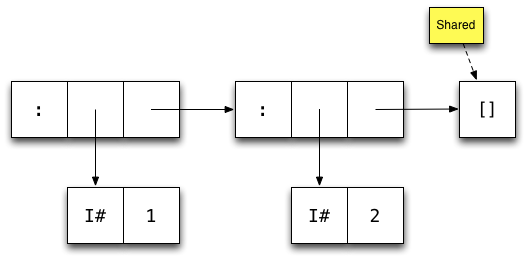
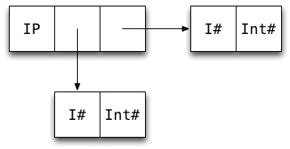
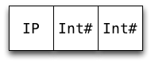

% Writing Production Quality Code
% Johan Tibell
% May 31, 2015

# Caveats

* Much of this is GHC specific.

* Some of the patterns trade generality/beauty for performance.  Only
  use these when needed.

* The following patterns are guidelines, not rules.  There are
  exceptions.

# Reasoning about space usage

Knowing how GHC represents values in memory is useful because

* it allows us to approximate memory usage, and

* it allows us to count the number of indirections, which affect
  cache behavior.

# Memory usage for data constructors

Rule of thumb: a constructor uses one word for a header, and one
word for each field.  So e.g.

~~~~ {.haskell}
data Uno = Uno a
data Due = Due a b
~~~~

an `Uno` takes 2 words, and a `Due` takes 3.

* Exception: a constructor with no fields (like `Nothing` or `True`)
  takes no space, as it's shared among all uses.

# Memory layout

Here's how GHC represents the list `[1,2]` in memory:

* Each box represents one machine word

* Arrows represent pointers

* Each constructor has one word overhead for e.g. GC information

# Refresher: unboxed types

GHC defines a number of _unboxed_ types.  These typically represent
primitive machine types.

* By convention, the names of these types end with a
  `#`.

* Most unboxed types take one word (except
  e.g. `Double#` on 32-bit machines)

* Values of unboxed types cannot be thunks.

* The basic types are defined in terms unboxed types e.g.

~~~~ {.haskell}
data Int = I# Int#
~~~~

* We call types such as `Int` _boxed_ types

# Poll

How many machine words is needed to store a value of this data type:

~~~~ {.haskell}
data IntPair = IP Int Int
~~~~

* 3?

* 5?

* 7?

* 9?

Tip: Draw a boxes-and-arrows diagram.

# IntPair memory layout

So an `IntPair` value takes 7 words.

# Refresher: unpacking

GHC gives us some control over data representation via the
`UNPACK` pragma.

* The pragma unpacks the contents of a constructor into the
  field of another constructor, removing one level of indirection
  and one constructor header.

* Only fields that are strict, monomorphic, and single-constructor
  can be unpacked.

The pragma is added just before the bang pattern:

~~~~ {.haskell}
data Foo = Foo {-# UNPACK #-} !SomeType
~~~~

GHC 7 and later will warn if an `UNPACK` pragma cannot be used because
it fails the use constraint.

# Unpacking example

~~~~ {.haskell}
data IntPair = IP !Int !Int
~~~~

~~~~ {.haskell}
data IntPair = IP {-# UNPACK #-} !Int
                  {-# UNPACK #-} !Int
~~~~

# Benefits of unpacking

When the pragma applies, it offers the following benefits:

* Reduced memory usage (4 words saved in the case of `IntPair`)

* Removes indirection

Caveat: There are (rare) cases where unpacking hurts performance
e.g. if the value is passed to a non-strict function, as it needs to
be reboxed.

**Unpacking is one of the most important optimizations available to
 us.**

# A structural comparison with C

By reference:

~~~~ {.haskell}
-- Haskell
data A = A !Int
~~~~

~~~~ {.c}
// C
struct A {
  int *a;
};
~~~~

By value:

~~~~ {.haskell}
-- Haskell
data A = A {-# UNPACK #-} !Int
~~~~

~~~~ {.c}
// C
struct A {
  int a;
};
~~~~

If you can figure out which C representation you want, you can figure
out which Haskell representation you want.

# TODO: Discuss why strict types remove space leaks

# TODO: Summarize the guideline for production quality code

# Think about your data representation

* A linked-list of linked-lists of pointers to integers is not a good
way to represent a bitmap!  (Someone actually did this and complained
Haskell was slow.)

* Make use of modern data types: `ByteString`, `Text`, `Vector`,
  `HashMap`, etc.

# Unpack scalar fields

Always unpack scalar fields (e.g. `Int`, `Double`):

~~~~ {.haskell}
data Vec3 = Vec3 {-# UNPACK #-} !Double
                 {-# UNPACK #-} !Double
                 {-# UNPACK #-} !Double
~~~~

* This is **the most important optimization available** to us.

* GHC does Good Things (tm) to strict, unpacked fields.

* You can use `-funbox-strict-fields` on a per file basis if `UNPACK`
  is too verbose.

# Use a strict spine for data structures

* Most container types have a strict spine e.g. `Data.Map`:

~~~~ {.haskell}
data Map k a = Tip
             | Bin {-# UNPACK #-} !Size !k a
                   !(Map k a) !(Map k a)
~~~~

  (Note the bang on the `Map k a` fields.)

* Strict spines cause more work to be done up-front (e.g. on insert),
  when the data structure is in cache, rather than later (e.g. on the
  next lookup.)

* Does not always apply (e.g. when representing streams and other
  infitinte structures.)

# Specialized data types are sometimes faster

* Polymorphic fields are always stored as pointer-to-thing, which
  increases memory usage and decreases cache locality.  Compare:

~~~~ {.haskell}
data Tree a = Leaf | Bin a !(Tree a) !(Tree a)
data IntTree = IntLeaf | IntBin {-# UNPACK #-} !Int !IntTree !IntTree
~~~~

* Specialized data types can be faster, but at the cost of code
  duplication.  **Benchmark** your code and only use them if really
  needed.

# Inline recursive functions using a wrapper

* GHC does not inline recursive functions:

~~~~ {.haskell}
map :: (a -> b) -> [a] -> [b]
map _ []     = []
map f (x:xs) = f x : map f xs
~~~~

* **If** you want to inline a recursive function, use a non-recursive
  wrapper like so:

~~~~ {.haskell}
map :: (a -> b) -> [a] -> [b]
map f = go
  where
    go []     = []
    go (x:xs) = f x : go xs
~~~~

* You still need to figure out if you want a particular function
  inlined (e.g. see the next slide.)

# Inline HOFs to avoid indirect calls

* Calling an unknown function (e.g. a function that's passed as an
  argument) is more expensive than calling a known function.  Such
  *indirect* calls appear in higher-order functions:

~~~~ {.haskell}
map :: (a -> b) -> [a] -> [b]
map _ []     = []
map f (x:xs) = f x : map f xs

g xs = map (+1) xs  -- map is recursive => not inlined
~~~~

* At the cost of increased code size, we can inline `map` into `g` by
  using the non-recursive wrapper trick on the previous slide together
  with an `INLINE` pragma.

* Inline HOFs if the higher-order argument is used a lot (e.g. in
  `map`, but not in `Data.Map.insertWith`.)

# Use strict data types in accumulators

If you're using a composite accumulator (e.g. a pair), make sure it has
strict fields.

Allocates on each iteration:

~~~~ {.haskell}
mean :: [Double] -> Double
mean xs = s / n
  where (s, n) = foldl' (\ (s, n) x -> (s+x, n+1)) (0, 0) xs
~~~~

Doesn't allocate on each iteration:

~~~~ {.haskell}
data StrictPair a b = SP !a !b

mean2 :: [Double] -> Double
mean2 xs = s / n
  where SP s n = foldl' (\ (SP s n) x -> SP (s+x) (n+1)) (SP 0 0) xs
~~~~

Haskell makes it cheap to create throwaway data types like
`StrictPair`: one line of code.

# Use strict returns in monadic code

`return` often wraps the value in some kind of (lazy) box.  This is
often not what we want, especially when returning some arithmetic
expression.  For example, assuming we're in a state monad:

~~~~ {.haskell}
return $ x + y
~~~~

creates a thunk.  We most likely want:

~~~~ {.haskell}
return $! x + y
~~~~

# Beware of the lazy base case

Functions that would otherwise be strict might be made lazy by the
"base case":

~~~~ {.haskell}
data Tree = Leaf
          | Bin Key Value !Tree !Tree

insert :: Key -> Value -> Tree
insert k v Leaf = Bin k v Leaf Leaf  -- lazy in @k@
insert k v (Bin k' v' l r)
   | k < k'    = ...
   | otherwise = ...
~~~~

Since GHC does good things to strict arguments, we should make the
base case strict, unless the extra laziness is useful:

~~~~ {.haskell}
insert !k v Leaf = Bin k v Leaf Leaf  -- strict in @k@
~~~~

In this case GHC might unbox the key, making all those comparisons
cheaper.

# Beware of returning expressions inside lazy data types

* Remember that many standard data types are lazy (e.g. `Maybe`,
  `Either`).

* This means that it's easy to be lazier than you intend by wrapping
  an expression in such a value:

~~~~ {.haskell}
safeDiv :: Int -> Int -> Maybe Int
safeDiv _ 0 = Nothing
safeDiv x y = Just $ x / y  -- creates thunk
~~~~

* Force the value (e.g. using `$!`) before wrapping it in the
  constructor.

# Summary

* Strict fields are good for performance.

* Think about your data representation (and use `UNPACK` where
  appropriate.)
